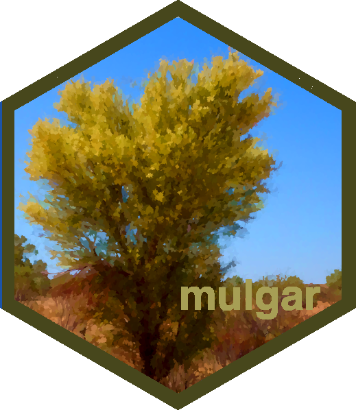

# Tutorial on high-dimensional visualisation



Website: [https://dicook.github.io/mulgar_tutorial](https://dicook.github.io/mulgar_tutorial)

This is for scientists and data science practitioners who regularly work with high-dimensional data and models and are interested in learning how to better visualise them. You will learn about recognising structure in high-dimensional data, including clusters, outliers, non-linear relationships, and how this can be used with methods such as supervised classification, cluster analysis and non-linear dimension reduction. 

Background: Participants should have a good working knowledge of R, and some background in multivariate statistical methods and/or data mining techniques.

**Presenters**: 

Dianne Cook is Professor of Statistics at Monash University in Melbourne, Australia. Her research is on visualisation of high-dimensional data, and on bridging the gap between exploratory graphics and statistical inference. She is a Fellow of the American Statistical Association, past editor of the Journal of Computational and Graphical Statistics, and the R Journal, Member of the R Foundation, and elected member of the International Statistical Institute, and author of several R packages.

Ursula Laa is an Assistant Professor at the Institute of Statistics of the University of Natural Resources and Life Sciences in Vienna. She works on new methods for the visualization of multivariate data and models, and on interdisciplinary applications of statistics and data science methods in different fields.


## Structure of tutorial

Background: Participants should have a good working knowledge of R, and some background in multivariate statistical methods and/or data mining techniques.

| time | topic |
|------|-------|
|9:00-9:20|	Introduction: What is high-dimensional data, why visualise and overview of methods| 
|9:20-9:45|	Basics of linear projections, and recognising high-d structure|
|9:45-10:30|	Effectively reducing your data dimension, in association with non-linear dimension reduction|
|10:30-11:00|	BREAK|
|11:00-11:45|	Understanding clusters in data using visualisation|
|11:45-12:30|	Building better classification models with visual input|

[Session 1 Slides](https://dicook.github.io/mulgar_tutorial/slides1.html)

[Session 2 Slides](https://dicook.github.io/mulgar_tutorial/slides2.html)

[Zip file of materials](https://dicook.github.io/mulgar_tutorial/tutorial.zip)

## Getting started

1. You should have a reasonably up-to-date version of R and R Studio, eg RStudio 2024.04.1 and R version 4.4.0 (2024-04-24). Install the following packages, and their dependencies.

```
install.packages(c("readr", "tidyr", "dplyr", "ggplot2", "tourr",
  "mulgar", "geozoo", "detourr", "palmerpenguins", "GGally", 
  "MASS", "randomForest", "mclust", "crosstalk", "plotly", 
  "viridis", "conflicted"), dependencies=c("Depends", "Imports"))
```

Ideally, you install this package from GitHub:

```
remotes::install_github("casperhart/detourr")
```

2. Download the [Zip file of materials](https://dicook.github.io/mulgar_tutorial/tutorial.zip) to your laptop, and unzip it. 

3. Download just the R scripts, [slides1.R](https://dicook.github.io/mulgar_tutorial/slides1.R), [slides2.R](https://dicook.github.io/mulgar_tutorial/slides2.R)

4. Open your RStudio be clicking on `tutorial.Rproj`. 

GitHub repo with all materials is 
[https://dicook.github.io/mulgar_tutorial/](https://dicook.github.io/mulgar_tutorial).


## Contributing

We welcome contributions. If you have a suggestion or a bug report please post this as an [issue](https://github.com/dicook/mulgar_tutorial/issues) on GitHub.

The online version is licensed under a
[Creative Commons Attribution-NonCommercial-ShareAlike 4.0 International License][cc-by-nc-sa].

The work is written under a [contributor code of conduct](https://github.com/dicook/mulgar_book/CODE_OF_CONDUCT.md). By participating in this project you agree to abide by its terms and the terms of the license. Instructions for making contributions can be found in the [contributing.md](https://github.com/dicook/mulgar_book/contributing.md) file.

[![CC BY-NC-SA 4.0][cc-by-nc-sa-image]][cc-by-nc-sa]

[cc-by-nc-sa]: http://creativecommons.org/licenses/by-nc-sa/4.0/
[cc-by-nc-sa-image]: https://licensebuttons.net/l/by-nc-sa/4.0/88x31.png
[cc-by-nc-sa-shield]: https://img.shields.io/badge/License-CC%20BY--NC--SA%204.0-lightgrey.svg
